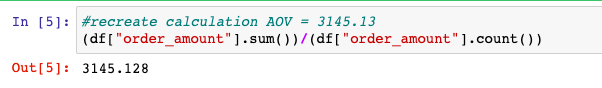
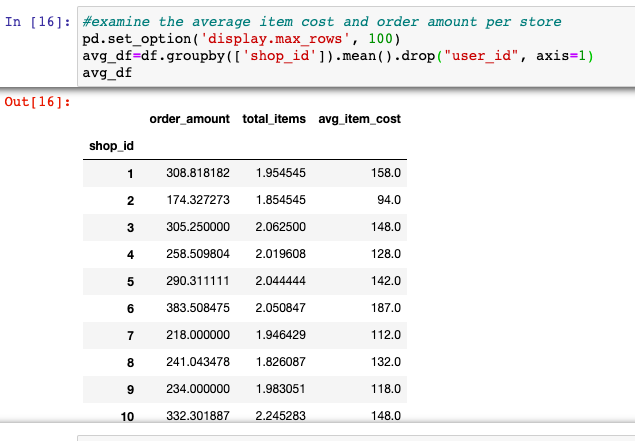

# Shopify_Sneakers

## Purpose of the Analysis
This analysis was undertaken as a Shopify skills assessment challenge.

This challenge demonstrates analytical thinking, as well as proficiency with the analytical tools of Python and SQL.

## Question 1

On Shopify, we have exactly 100 sneaker shops, and each of these shops sells only one model of shoe. We want to do some analysis of the average order value (AOV). When we look at orders data over a 30 day window, we naively calculate an AOV of $3145.13. Given that we know these shops are selling sneakers, a relatively affordable item, something seems wrong with our analysis. 

### a.	Think about what could be going wrong with our calculation. Think about a better way to evaluate this data. 

I was able to recreate the average order value from the previous analysis.
</img>

Judging by the high AOV, it looks like there is either an input error, or some outlying data. 

After some analysis I discovered that there is a regular bulk order that goes through one of the stores (Store 42) where 2000 units are purchased at a time (for $704000). There is also some interesting data at Store 78: The average item (Sneaker) cost is $25725.00. The transactions at these stores are skewing the Average Order Value. This may or may not need further investigation depending on the nature of the Shopify business. 

Because each store only carries one model of shoe, we can also see that they only carry one price point. Each store's average item cost is the price of their one shoe.

A more promising, but also compromised metric might be UPT(units per transaction). However, we can see that this is also skewed by the 2000 unit bulk sale is coming from Store 42.

### b.	What metric would you report for this dataset?

There are at least 2 options, depending on what the company is most interested in. 

The first would be to calculate the AOV or UPT per Store. That would give a good idea as to how much each store is selling. 

Another option for the bigger picture analysis would be to examine other measures of central tendency such as median and mode and compare each stores AOV/UPT. 

The limitations of the shoe breadth per store allows us to extrapolate some details about customer preferred styles which could be particularly useful in this case study.

### c.	What is its value?

I think the most valuable metric would be to determine each store's AOV and compare it to the median. 

I have included a snippet of the dataframe here:

</img>

The entire dataframe is available 
<a href="AOV_Shop_data.csv">here</a>.

The median value of the entire dataset order value is $284.

The mode is $153.

## Question 2

For this question you’ll need to use SQL. Follow this link to access the data set required for the challenge. Please use queries to answer the following questions. Paste your queries along with your final numerical answers below.

### a.	How many orders were shipped by Speedy Express in total?

54

    SELECT COUNT (ShipperName)
    FROM Orders as o
    LEFT JOIN Shippers as s
    WHERE o.ShipperID=s.ShipperID
    AND ShipperName IN ('Speedy Express');

### b.	What is the last name of the employee with the most orders?
Peacock, Margaret had the most orders (40).

    SELECT COUNT(o.OrderID),
    o.EmployeeID, 
    e.LastName, 
    e.FirstName
    FROM Employees as e
    LEFT JOIN Orders as o
    WHERE e.EmployeeID=o.EmployeeID
    GROUP BY o.EmployeeID
    ORDER BY COUNT(o.OrderID) DESC;

### c.	What product was ordered the most by customers in Germany?
The product that was ordered the most frequently by customers in Germany was ProductID #31 - Gorgonzola Telino

    SELECT COUNT(p.ProductID),
    p.ProductID,
    p.ProductName,
    o.OrderID, 
    c.CustomerID,
    c.Country
    FROM Customers as c
    INNER JOIN Orders as o
    ON c.CustomerID=o.CustomerID
    LEFT JOIN OrderDetails as od
    ON o.OrderID=od.OrderID
    LEFT JOIN Products as p
    ON od.ProductID = p.ProductID
    WHERE c.Country='Germany'
    GROUP BY p.ProductID
    ORDER BY COUNT(p.ProductID) DESC;